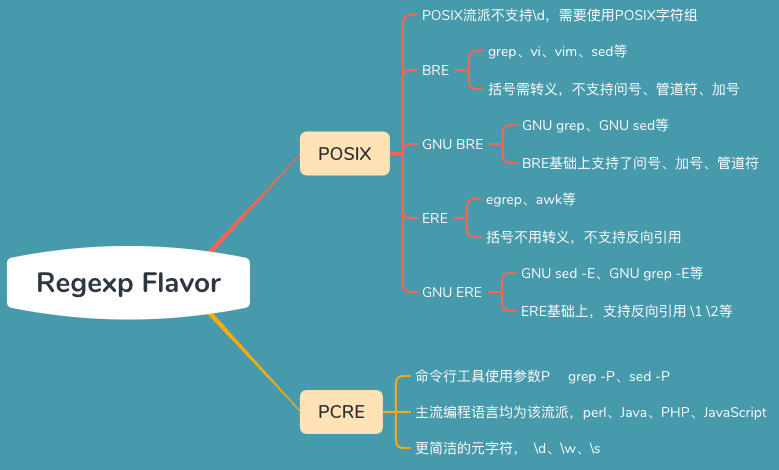
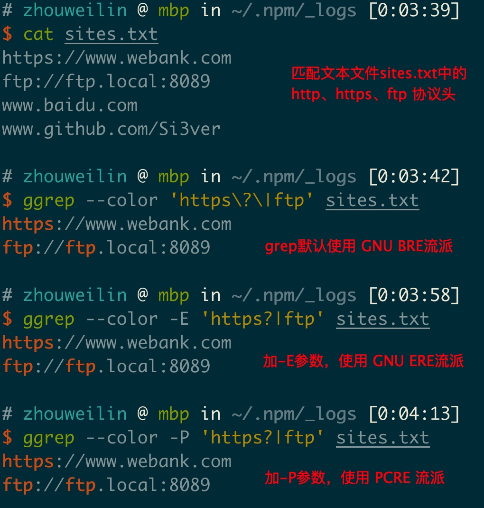
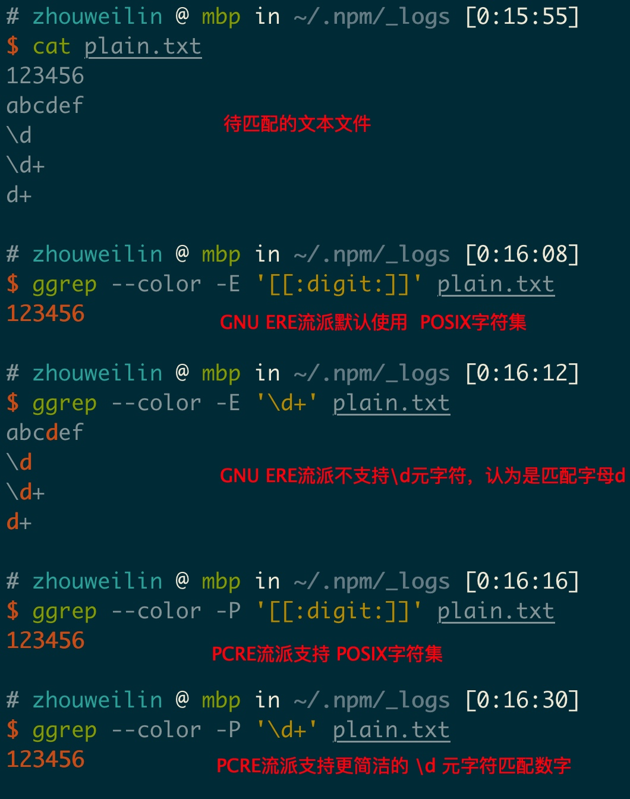
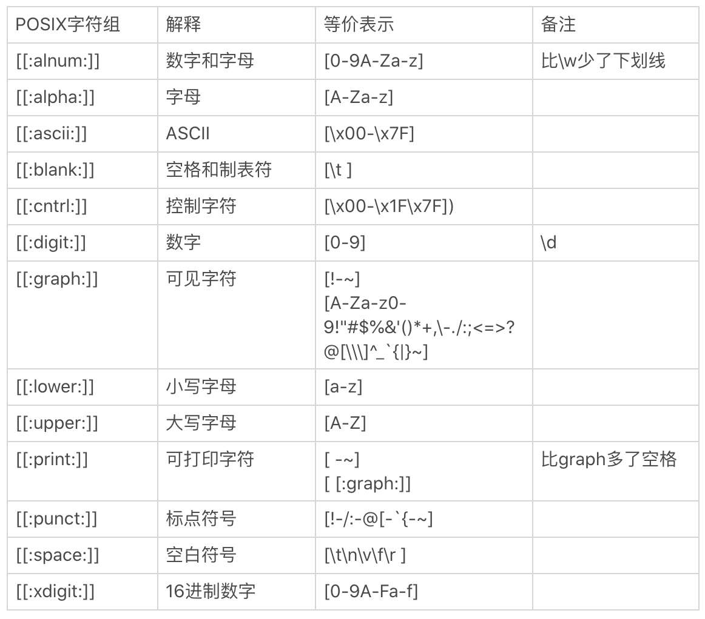

# 细说正则表达式中的流派

正则表达式主要分为 POSIX 流派和 PCRE 流派。

POSIX流派细分为 BRE 流派和 ERE 流派。其中，GNU BRE 和 GNU ERE 分别对其进行了功能扩展。

本人总结了一张脑图如下，

 
##  grep命令使用不同流派匹配

BRE 和 ERE 显著区别是前者需要给常用符号转义，后者不需要。

可以看到，PCRE流派支持更简洁的 \d、\w、\s 表示数字、字母、空白符。

关于POSIX字符集，总结如下

 
相比于POSIX流派，PCRE流派还支持环视等高级功能。

最后，推荐大家统一使用 PCRE 流派的正则。

补充：关于命令行常用工具，如grep、sed、awk。 由于mac os 默认采用BSD风格的命令工具，用户可以安装 coreutil 工具，然后使用ggrep、gsed、gawk，统一到 GNU 风格命令行工具。

参考资料：
https://www.infoq.cn/article/2011/07/regular-expressions-6-POSIX/

https://www.php.net/manual/zh/reference.pcre.pattern.differences.php

https://deerchao.cn/tutorials/regex/diffs.html

